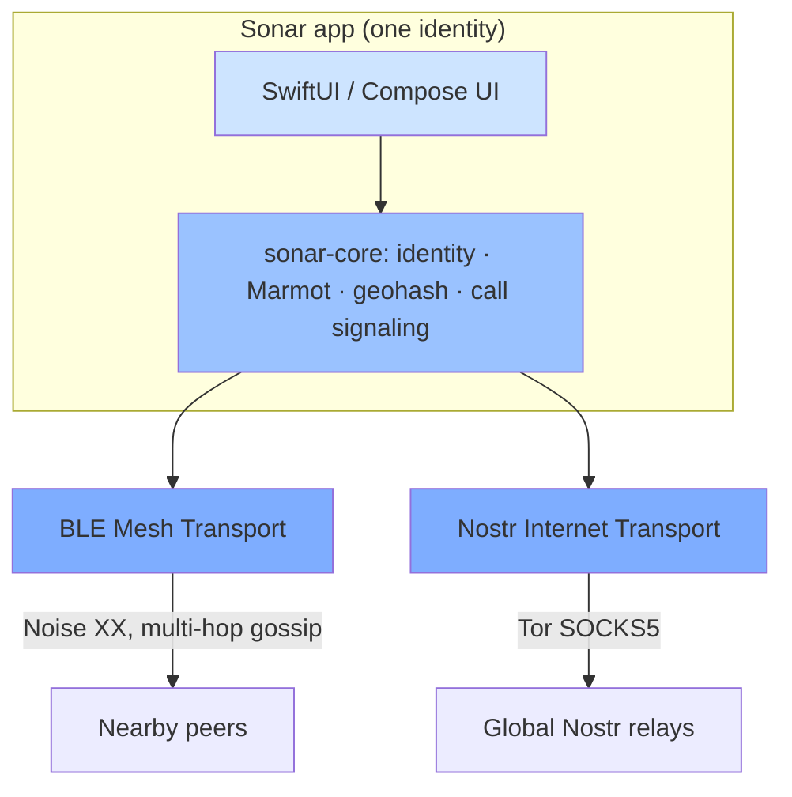
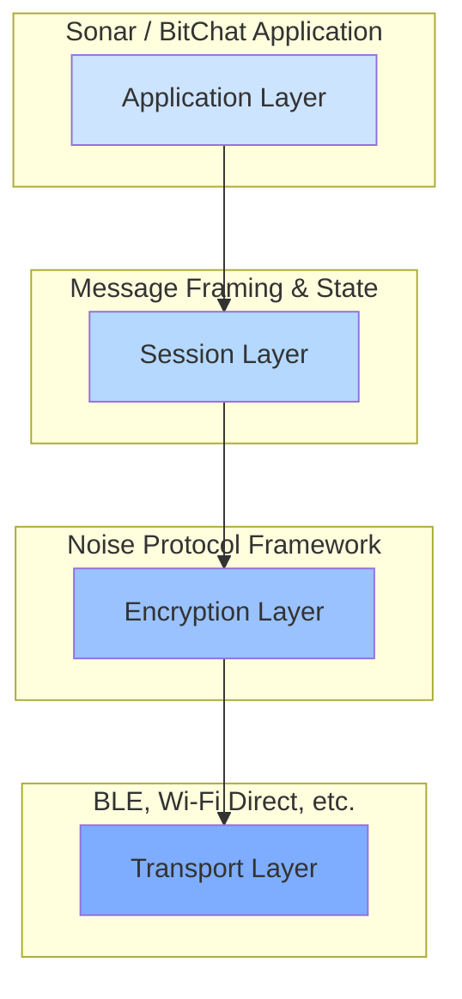
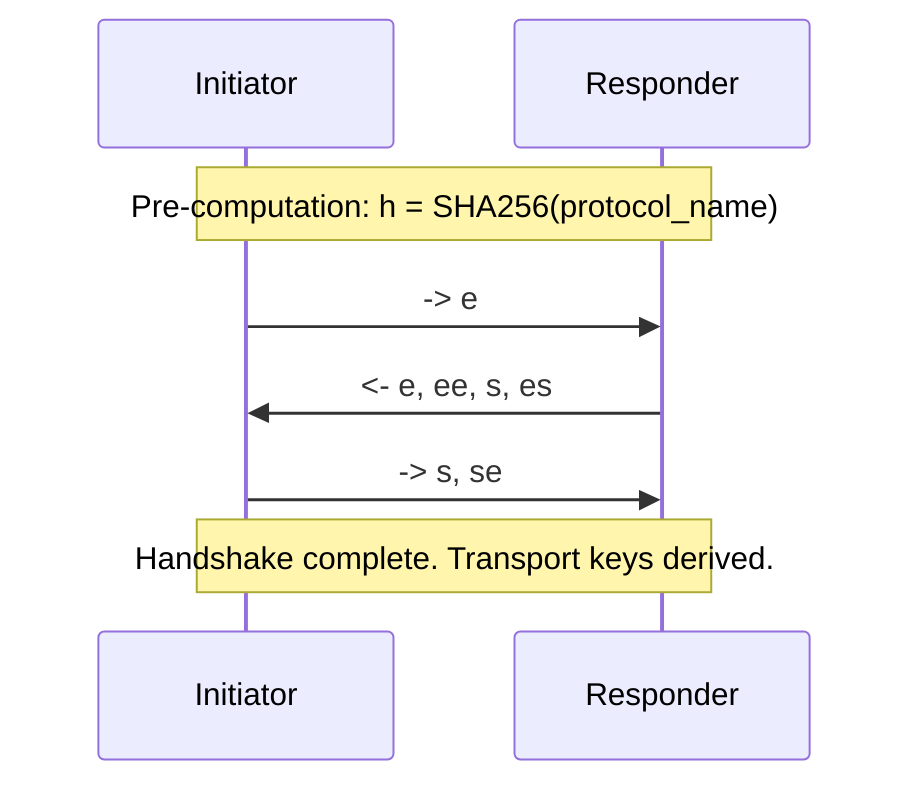

# Sonar Protocol Whitepaper

**Version 2.0**

**Date: June 17, 2026**

---

## Abstract

Sonar is a decentralized, privacy-first messenger, social radar, and Lightning wallet. It is built on the BitChat mesh foundation — mutually-authenticated, end-to-end-encrypted messaging over an ad-hoc Bluetooth Low Energy (BLE) mesh — and extends it into a **dual-transport** system that also reaches the global internet through the open **Nostr** network. On top of those two transports Sonar layers a single self-custodial identity (a Nostr keypair), end-to-end-encrypted group messaging via **Marmot** (Messaging Layer Security, MLS, over Nostr), an embedded **Lightning wallet**, peer-to-peer **voice and video calls**, and **Tor-by-default** networking. There are no accounts, no phone numbers, and no central servers: your identity is a key you hold, and the same key restores your profile, your conversations, and your wallet on any device.

This whitepaper specifies the Sonar protocol stack. Part I documents the BitChat mesh foundation (the Noise transport, binary packet format, and gossip routing) that Sonar inherits unchanged. Part II specifies the Sonar extensions: the identity and account model, the Nostr internet layer, the Marmot secure-messaging protocol, cross-transport discovery, the payment conventions, the call subsystem, and the cross-platform architecture that drives all of it from one shared Rust core.

---

## 1. Introduction

Centralized messengers are convenient until the network, the company, or the jurisdiction fails. BitChat answered that with a serverless BLE mesh for when the internet is unavailable or untrustworthy — protests, disasters, flights, remote areas. Sonar keeps that property and adds the missing half: **reach**. When the person you want is in Bluetooth range, Sonar finds and talks to them phone-to-phone; when they are not, the same conversation continues over the open internet via Nostr relays that nobody owns.

Sonar's design goals are a superset of BitChat's:

* **Confidentiality** — all direct communication is unreadable to third parties.
* **Authentication** — users can verify who they are talking to, out of band.
* **Integrity** — messages cannot be tampered with in transit.
* **Forward secrecy & post-compromise security** — compromising long-term keys must not expose past (or, for MLS groups, future) messages.
* **Deniability** — it should be hard to cryptographically prove a specific user authored a specific message.
* **Resilience** — the protocol must work in lossy, low-bandwidth, intermittently-connected conditions.
* **Reachability** — a conversation must survive the transport switching between Bluetooth and the internet (Sonar).
* **Self-custody** — the user holds the only key; the account is portable and Sonar can never recover or freeze it (Sonar).
* **Metadata resistance** — network-level observers should learn as little as possible about who talks to whom (Sonar; Tor-by-default, ephemeral keys, gift-wrapping, fixed-size padding).
* **Value transfer** — sending money should be as natural as sending a message, over the same two transports (Sonar).

---

## 2. System Overview and Dual-Transport Architecture

Sonar routes every message automatically over whichever transport can reach the recipient, and tells the user which one carried it.



* **Mesh transport (offline):** the BitChat BLE mesh — direct, multi-hop, Noise-encrypted, internet-free (Part I).
* **Internet transport (online):** Nostr relays reached over Tor, carrying Marmot group messages, NIP-17 direct messages, and ephemeral geohash channels (Part II).
* **Automatic selection:** for a direct message Sonar prefers Bluetooth when the peer is in range (fastest, most private), falls back to the internet otherwise, and queues when neither is available, delivering when a transport returns.

Everything above the transports — identity, Marmot/MLS, geohash, payments, and call signaling — lives in a single headless Rust core (`core/sonar-core`) that is compiled into every platform (Section 11). The user-visible "bubble color" reflects the transport, the way iMessage distinguishes platforms — here it distinguishes *distance*.

---

## 3. Identity and Account Model

A Sonar user holds two layers of cryptographic identity.

1. **Mesh identity (inherited from BitChat):** a long-term **Curve25519** Noise static key pair plus an **Ed25519** signing key pair, generated on first launch and stored in the platform keychain. These authenticate mesh sessions and sign mesh announcements (Section 5).
2. **Account identity (Sonar):** a **secp256k1 Nostr key pair** — the canonical, portable account. It is presented as bech32 `npub1…` (public) and `nsec1…` (secret), or as 64-char hex. This single keypair is the root of the user's internet presence and is implemented in `core/sonar-core/src/identity.rs` (`Identity::generate`, `Identity::import`, `Identity::export_nsec`).

### 3.1. One npub = one account (capabilities)

The Nostr keypair is not "Sonar-only"; it is a standard Nostr identity, and a single `npub` simultaneously carries every Sonar capability:

* **Secure messaging** — Marmot/MLS group membership and history (Section 6).
* **Profile** — the Nostr kind-0 profile (display name, avatar, NIP-05).
* **Geohash presence** — per-channel *ephemeral* sub-keys (Section 5.3 of Part II) so public-channel activity is unlinkable to the main key.
* **Calls** — an Ed25519 transport key for iroh, deterministically derived from the Nostr secret (Section 10).
* **Payments** — the embedded Lightning wallet derives from the same secret, so the same `nsec` restores the same wallet (Section 9).

### 3.2. Derived sub-identities

All sub-identities are deterministic functions of the root Nostr secret, so they survive reinstall and are reproducible across platforms, while being domain-separated and unlinkable to each other:

* **Geohash channel key:** `SHA256("sonar-geohash-v1:" ‖ nsec ‖ geohash)` → a fresh secp256k1 secret per geohash cell (`core/sonar-core/src/geohash.rs`).
* **Call transport key:** `HKDF-SHA256(nostr_secret, info = "sonar/call/iroh/v1")` → the 32-byte Ed25519 secret for the iroh endpoint (`core/sonar-core/src/call/identity.rs`).

### 3.3. Fingerprint and verification

The mesh fingerprint remains `SHA256(StaticPublicKey_Curve25519)`, read aloud or scanned out-of-band to confirm a real-world identity (Section 4). The account is shared as the `npub` (or a QR of it). Sonar's profile UI presents the key for **self-custody**: it can reveal and copy the `nsec` for backup ("Export private key"), and a fresh install can **restore** an existing account by pasting an `nsec` on the get-started screen. Because the key never leaves the device except by explicit user export, Sonar can neither recover nor revoke it — the security and the responsibility are the user's.

---

# Part I — The Mesh Foundation (inherited from BitChat)

Sonar reuses the BitChat mesh protocol unchanged for offline, proximity communication. Sections 4–8 specify that foundation; readers familiar with the BitChat whitepaper can skip to Part II.

## 4. The Mesh Protocol Stack

The mesh protocol is a four-layer stack.



* **Application Layer:** user-facing messages (`BitchatMessage`), acknowledgments (`DeliveryAck`), and Sonar control lines (`⚡PAY`, `☎CALL`).
* **Session Layer:** the `BitchatPacket` — routing (TTL), typing, fragmentation, and compact binary serialization.
* **Encryption Layer:** the Noise Protocol Framework — handshake, session management, transport encryption.
* **Transport Layer:** the physical medium (BLE), abstracted from the core protocol.

### 4.1. Peer verification, favorites, and blocking

The Noise handshake authenticates a peer's *key*, not the *person*. Users perform out-of-band verification by comparing fingerprints and then mark a peer **verified**. Peers may also be marked **favorites** (local prioritization) or **blocked** (incoming packets from that fingerprint are discarded at the earliest stage, silently).

## 5. The Noise Protocol Layer

Mesh sessions use **`Noise_XX_25519_ChaChaPoly_SHA256`**.

* **`XX` pattern:** mutual authentication and forward secrecy with no prior knowledge of the peer's static key — ideal for decentralized P2P. Keys are exchanged and authenticated across a three-message handshake.
* **`25519`:** Curve25519 Diffie-Hellman. **`ChaChaPoly`:** ChaCha20-Poly1305 AEAD. **`SHA256`:** all hashing.



On completion both parties hold bidirectional transport ciphers; the final handshake hash provides channel binding. The `NoiseSessionManager` creates sessions, serializes handshakes to avoid races, stores the `sendCipher`/`receiveCipher`, and re-keys periodically.

## 6. The Binary Packet Format

To minimize bandwidth, packets are serialized into a compact, fixed-where-possible binary format that resists traffic analysis.

| Field           | Size (bytes) | Description                                                                 |
|-----------------|--------------|-----------------------------------------------------------------------------|
| **Header**      | **13**       | Fixed-size header                                                            |
| Version         | 1            | Protocol version (`1`; `2` adds source routing, Section 7.1).               |
| Type            | 1            | Message type (`message`, `deliveryAck`, `noiseHandshakeInit`, `0x53`, …).   |
| TTL             | 1            | Time-To-Live for mesh routing; decremented per hop.                         |
| Timestamp       | 8            | `UInt64` ms timestamp.                                                       |
| Flags           | 1            | `hasRecipient`, `hasSignature`, `isCompressed` (`hasRoute` in v2).          |
| Payload Length  | 2 (v1)       | `UInt16` payload length (expands to 4 bytes in v2).                         |
| Sender ID       | 8            | Truncated peer ID of the sender.                                            |
| Recipient ID    | 8 (opt)      | Recipient peer ID; broadcast if `0xFF…FF`.                                  |
| Payload         | variable     | Content as defined by `Type`.                                              |
| Signature       | 64 (opt)     | `Ed25519` signature when `hasSignature` is set.                            |

**Padding:** packets are padded to the next block size (256/512/1024/2048 bytes, PKCS#7-style) to obscure true message length.

For `message` packets the payload is a binary `BitchatMessage` (flags, timestamp, UUID, sender nickname, UTF-8 content, optional original-sender and recipient-nickname fields).

## 7. Message Routing and Propagation

The mesh has no routers. Packets propagate peer-to-peer.

* **Direct connection:** adjacent peers exchange Noise-encrypted packets directly.
* **Gossip with Bloom filters:** a peer relays packets not destined for it, using an `OptimizedBloomFilter` of recently-seen packet IDs to suppress loops (false positives are rare and self-healing; false negatives impossible).
* **TTL:** every packet carries a TTL, decremented per hop; at zero it is processed (if local) but not relayed.
* **Private vs. broadcast:** a packet with a specific `recipientID` is relayed *opaquely* — only the final recipient can decrypt it. The `0xFF…FF` recipient is a network-wide broadcast.
* **Reliability:** `DeliveryAck` and `ReadReceipt` packets report message lifecycle; a `MessageRetryService` re-sends unacknowledged private messages.
* **Fragmentation:** messages larger than the BLE MTU are split into `fragmentStart`/`fragmentContinue`/`fragmentEnd` packets and reassembled by the receiver.

### 7.1. Source routing (packet v2)

Version-2 packets widen the length field to 4 bytes and add an optional `HAS_ROUTE` (`0x08`) flag. A source route — `[count][hop₁(8B)]…[hopN(8B)]` listing intermediate hops only — lets a sender unicast along a known path instead of flooding, falling back to gossip if a hop is unreachable. Nodes advertise their confirmed direct neighbors via an announce TLV (`0x04`); an edge is usable only if *both* endpoints announce each other. The Ed25519 signature covers the route, so a relay cannot rewrite the path. v1 clients ignore the routing data and continue to flood.

## 8. Mesh Security Considerations

* **Replay:** Noise transport nonces increment per message; a sliding-window replay filter (`NoiseCipherState`) drops replays and out-of-order messages.
* **DoS:** a `NoiseRateLimiter` bounds repeated handshake attempts per peer.
* **KCI:** the `XX` pattern authenticates both parties.
* **Identity binding:** key-to-nickname binding is an application concern; users must verify fingerprints out-of-band.
* **Traffic analysis:** fixed-size padding obscures message size from network observers.

---

# Part II — The Sonar Extensions

## 9. The Internet Layer: Tor and Nostr

When a peer is out of mesh range, Sonar reaches them over the internet through the open **Nostr** relay network. All such traffic is anonymized.

### 9.1. Tor by default

Every internet connection is routed through a local **Tor SOCKS5 proxy**, fail-closed, with no user-visible setting (`ios/bitchat/Services/TorManager.swift`, `TorURLSession.swift`). Tor is bootstrapped on launch (embedded client, `ClientOnly 1`, `SOCKSPort 127.0.0.1:39050`), and relay/HTTP clients `awaitReady()` before sending. There is no clearnet fallback in release builds — a dev-only `BITCHAT_DEV_ALLOW_CLEARNET` flag exists for debugging. This prevents the user's IP from leaking to relays. The underlying anonymizing transport is provided by **Arti** (`ios/localPackages/Arti`).

### 9.2. Nostr relays and direct messages

Sonar speaks Nostr over WebSocket (through Tor) to a curated, geographically distributed relay set (`relays/online_relays_gps.csv`, surfaced by a relay directory). Direct messages that travel over the internet (the fallback path, and non-Marmot peers) use **NIP-17 gift-wrapped** private messages (NIP-44 encryption inside a NIP-59 wrap), so relays see neither sender, recipient, nor content of the inner message.

### 9.3. Geohash location channels and presence

Sonar offers public, place-based chat addressed by **geohash** cell rather than coordinate. Channels span precisions from region (≈1,250 km) down to block (≈150 m); the UI presents one "Around you" place that zooms across precisions with real place names.

* **Events:** channel chat and presence ride **ephemeral Nostr events** (geohash-tagged with `["g","<geohash>"]`, chat additionally `["n","<nickname>"]`), which relays do not persist; clients buffer them in memory.
* **Per-channel identity:** every message in a geohash channel is signed with the *ephemeral* sub-key derived in Section 3.2, so public activity is unlinkable to the user's main `npub` and across precisions.
* **Presence privacy:** heartbeats are emitted on an average-60-second jittered cadence, only to low-precision channels, with per-broadcast random delays to decorrelate the ephemeral keys; participants are counted "present" within a 5-minute TTL. High-precision rooms with no broadcasters render an indeterminate count rather than implying emptiness.

## 10. White Noise / Marmot — Secure Messaging (MLS over Nostr)

Sonar's flagship private and group messaging uses **Marmot**: the IETF **Messaging Layer Security (MLS)** group protocol with **Nostr** as the transport. It is wire-compatible with the **White Noise** client in both directions.

### 10.1. Cryptographic core

Marmot is implemented over the **MDK** (Marmot Development Kit, `marmot-protocol/mdk`) MLS engine, pinned to a specific git revision so the group/welcome/message wire format matches White Noise byte-for-byte (`core/sonar-core/src/marmot.rs`, `client.rs`). MLS provides group key agreement with **forward secrecy and post-compromise security** as members and devices come and go.

### 10.2. Nostr event model

| Purpose | Nostr kind | Notes |
|---|---|---|
| **KeyPackage** (MIP-00) | `30443` (addressable) | One per identity; lets others start a group with you. Published via `publish_key_package()`. |
| **Welcome** | `444` rumor | Delivered inside a **NIP-59 gift wrap** (kind `1059`) per invited member. |
| **Group message** | `445` | MLS ciphertext, signed by a per-event ephemeral key (the user key never signs a 445). |
| **Chat rumor** | `9` | The inner chat payload carried within a 445. |

### 10.3. Encrypted media (MIP-04)

Attachments (images, files, voice) are encrypted per the Marmot media spec, described by `imeta` tags (MIME, hash, dimensions) and stored on **Blossom** blob servers, fetched over HTTPS with a size cap. This is the `mip04` feature of MDK.

### 10.4. Persistence and sync

* **Storage:** MLS state and message history are persisted in an **SQLCipher**-encrypted database (`mdk-sqlite-storage`). The 32-byte database key is owned by the host platform keychain and supplied on every launch; there is no plaintext storage path in production.
* **Fast relay sync:** an incremental, watermark-based sync tracks the latest event timestamp per session (resumable across restarts), with a small overlap to absorb clock skew and a 7-day look-back window for gift-wrapped welcomes (to defeat timing analysis). Live subscriptions use stable IDs; a bounded pending buffer absorbs bursts. MLS engine mutations are strictly serialized (single-writer), and commits are merged only after they are published — the invariant that keeps a group from diverging.
* **Invitation semantics:** joining a group requires the recipient to *accept* a welcome; Sonar does not silently auto-join.

## 11. Cross-Transport Discovery (Sonar Discovery, `0x53`)

To make a person reachable *after* they walk out of Bluetooth range, Sonar advertises the account identity over the mesh and binds it to the mesh identity.

* **Packet:** a `BitchatPacket` of raw type **`0x53`** (ASCII `'S'`), sent alongside (never instead of) the BitChat announce.
* **Payload (TLV):** `0x01` version (`1`); `0x02` the 32-byte `npub`; `0x03` an optional BIP-353 payment address (`user@domain`); `0x04` a required capabilities bitfield (bit 0 = Marmot DM, bit 1 = payments). Unknown TLV types are skipped for forward compatibility.
* **Binding:** the packet is signed with the **same Ed25519 key** that signs the BitChat announce. A receiver accepts a `0x53` only for a `senderID` it has already verified an announce from, verifies the signature against that peer's known signing key, and drops stale (>15 min) or unverifiable packets silently. This cryptographically binds the `npub` to the mesh identity; the BIP-353 address is DNSSEC-verified later, at payment time.

Given a discovered `npub`, a client fetches the peer's KeyPackage from relays and bootstraps a Marmot conversation (Section 10) — so a face-to-face encounter becomes a durable, internet-reachable contact with no servers and no account exchange.

### 11.1. Conversation unification

A single person is one conversation regardless of transport. Sonar folds a peer's mesh fingerprint and their `npub` into one identity, so a chat that begins over Bluetooth and continues over White Noise (or vice-versa) does not split into two threads. The iOS app is the reference for this behavior.

## 12. Payments

Sonar treats money like a message: it travels the same two transports and arrives "sealed," to be opened by the recipient.

### 12.1. Embedded Lightning wallet

Sonar embeds a non-custodial **Lightning wallet** (Breez SDK Liquid, BOLT12/BIP-353 capable) that derives from the same identity, so the same `nsec` restores the same wallet. The wallet supports BIP-353 addresses (DNSSEC-resolved), BOLT12 offers, BOLT11 invoices, and LNURL-pay. It is gated on a `BREEZ_API_KEY` injected at build time (kept out of source control); without a key the wallet stays inactive rather than pretending to work. The wallet is wired through the cross-platform **unify-wallet** Kotlin Multiplatform codebase and reached on iOS via a `WalletBridgeService` facade; wallet secrets live in a dedicated keychain item, separate from messaging keys.

### 12.2. The `⚡PAY` sealed-coin convention

Person-to-person payments ride the encrypted chat transport as UTF-8 control lines — no new packet types — so they work over both mesh and internet and settle over Lightning at *claim* time, not send time:

```
⚡PAY|1|<uuid>|<sats>               sender → receiver  (sealed coin)
⚡PAYCLAIM|1|<uuid>|<bolt12offer>   receiver → sender  (claim)
⚡PAYDONE|1|<uuid>                  sender → receiver  (settled)
```

The receiver's wallet produces a BOLT12 offer; the sender pays it; both sides advance a local, idempotent ledger (`sealed → claiming → settling → claimed`). Crucially, **nothing leaves the wallet until the receiver claims and the sender pays the offer** — the live balance is always shown, the sealed coin is a promise riding the chat, and transcript replay after a relaunch is safe. Payment lines are only sent to peers whose capability bit advertises payments; BitChat-only peers never see them.

### 12.3. Unify nearby payments (BLE, payments-only)

Sonar interoperates with the **Unify** wallet ecosystem for ad-hoc, chat-free Bluetooth payments, playing **both** roles on isolated BLE stacks:

* **As payer** (`UnifyNearbyService`): a dedicated `CBCentralManager` scans for the Unify service UUID `b1f7e2a0-9c3d-4e8a-bf21-3a1c0de54f10`, reads/subscribes to the payload characteristic, reassembles a length-prefixed BIP-321/`lightning:` payload, and pays the extracted destination directly (not via the sealed-coin path).
* **As receiver** (`UnifyReceiverService`): a dedicated `CBPeripheralManager` advertises the same service and serves a framed amount-less BOLT12 offer (`bitcoin:?lno=…`), produced on demand by the wallet.

Both roles use protocol version 2, 180-byte NOTIFY chunks, an 8 KB payload cap, and a foreground-only advertising lifecycle (iOS strips the BLE local name in the background). They never appear in Messages — only on the radar, flagged "pay only."

## 13. Voice and Video Calls (`☎CALL`)

Sonar places peer-to-peer voice and video calls with no signaling server. The two halves are cleanly separated (`core/sonar-core/src/call/`).

### 13.1. Signaling (always built)

Call control rides the encrypted chat transport (Marmot or NIP-17) as `☎CALL` UTF-8 lines — a pure, dependency-free codec compiled into every build (`signaling.rs`):

```
☎CALL|1|OFFER|<callId>|<voice|video>|<nodeAddrB64>|<unixSecs>
☎CALL|1|ANSWER|<callId>|<accept|decline|busy>|<nodeAddrB64>
☎CALL|1|CANCEL|<callId>
☎CALL|1|END|<callId>|<reason>
```

`<nodeAddrB64>` is an opaque base64url serialization of the caller's iroh endpoint address (id + relay URLs + direct socket addresses). Hosts route these lines to the call engine and never render them as chat bubbles; unknown versions degrade to plain text.

### 13.2. Transport and media (feature-gated)

* **Transport (`calls` feature):** media flows over an **iroh** (n0) QUIC endpoint — Ed25519 `NodeId`-authenticated, encrypted, with relay-assisted NAT hole-punching, ALPN `sonar/call/0`. The endpoint's secret is the deterministically-derived call key from Section 3.2, so a peer's `NodeId` is reproducible and bound to their Sonar identity; the address is only ever shared inside an encrypted `☎CALL` message. RTP-over-QUIC is carried by a vendored, iroh-1.0-ported **iroh-roq** (`core/vendor/iroh-roq`).
* **Media (`calls-audio` feature):** **Opus** at 48 kHz / 20 ms frames (pure-Rust `unsafe-libopus`, no C build), with cross-platform device I/O via **cpal** (CoreAudio on Apple, oboe on Android, ALSA/Pulse on Linux).

Feature-gating keeps the default messaging build and CI lean (no iroh/opus), while device builds (`core/build-ios.sh`, `build-android.sh`) enable `calls-audio`.

## 14. Cross-Platform Architecture

Sonar is **one Rust core, many thin shells**. The core owns identity, Marmot/MLS, geohash, and call signaling; each platform supplies only its UI and OS-specific bits (radios, storage, notifications, wallet).

```
core/                  Rust workspace
├── sonar-core/        identity · Marmot (MLS over Nostr) · geohash · mesh · call signaling
├── sonar-ffi/         UniFFI bindings → Swift (static xcframework) + Kotlin (.so via JNA)
├── sonar-ble/         desktop BLE bridge (btleplug central + patched bluster peripheral)
└── vendor/iroh-roq/   RTP-over-QUIC media, ported to iroh 1.0

ios/                   native SwiftUI app (iOS + macOS) — the reference implementation
apps/sonar/            Compose Multiplatform app (Android + Desktop JVM)
web/                   SvelteKit marketing site
relays/ · design/ · docs/   shared, top-level
```

* **`sonar-ffi`** compiles to a **staticlib** (the iOS/macOS `sonarffi.xcframework`, consumed by the `SonarCore` Swift package) and a **cdylib** (`.so`/host dylib loaded over JNA on Android and Desktop). These artifacts are generated by `core/build-*.sh`, not committed.
* **`sonar-ble`** gives the JVM desktop real Bluetooth LE in both central (scan) and peripheral (advertise + GATT) roles, reached from Kotlin over JNA exactly like the core — closing the one capability the JVM lacks natively.
* **Invariants:** one Nostr identity per account across all platforms; the SQLCipher database is local (no cloud sync — the host owns backup); transcript parsing of `⚡PAY`/`☎CALL` and all relay/filter logic are identical across shells; deterministic crypto (Ed25519, HKDF, SHA-256) means test vectors round-trip across platforms.

## 15. Security and Privacy Considerations (Sonar)

Beyond the mesh considerations of Section 8:

* **Metadata at the relays:** Marmot 445 messages are signed by per-event ephemeral keys; welcomes are NIP-59 gift-wrapped; internet DMs are NIP-17 gift-wrapped; geohash activity uses per-channel ephemeral keys. Combined with Tor-by-default, a relay learns as little as the protocol allows.
* **Self-custody trade-off:** the user holds the only `nsec`. Export reveals bearer-grade key material — Sonar warns that anyone holding it controls the account and its balance, and that Sonar cannot recover it. Restore decodes the key on-device only; it is never transmitted.
* **Identity trust ladder:** a discovered `npub` is only as trusted as the mesh announce that carried it until verified out-of-band (QR / safety number / a completed Marmot session). Display names and geohash nicknames carry no proof and are treated as untrusted input.
* **Payment safety:** sealed coins move no value until claimed and paid; the ledger is idempotent and replay-safe. BIP-353 destinations are DNSSEC-verified at payment time.
* **Call binding:** a call's iroh `NodeId` is derived from, and transmitted only inside, the encrypted Sonar identity channel, and the QUIC session is mutually authenticated — media cannot be hijacked to an unrelated endpoint.
* **Secret handling:** API keys and signing material live only in gitignored local config or the platform keychain, never in source or logs.

## 16. Conclusion

Sonar takes BitChat's resilient, serverless mesh and gives it reach, identity, value, and voice without surrendering any of its original guarantees. By keeping the Noise mesh as an offline foundation and adding a Tor-anonymized Nostr internet layer, MLS-grade group messaging via Marmot, a self-custodial Lightning wallet with message-native payments, peer-to-peer calls over authenticated QUIC, and a single portable key that ties it all together, Sonar is a complete private-communication and value-transfer system that works whether or not the internet does — all driven from one shared Rust core across iOS, macOS, Android, and the desktop. The result is a messenger that treats the network — its presence, its absence, and its observers — as a feature.
