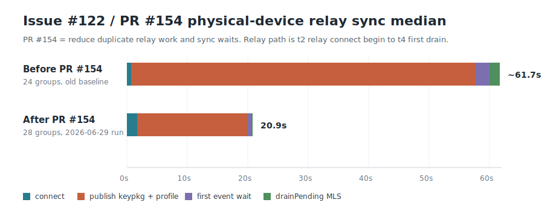

# Performance: cold-start + relay-sync benchmark

Status: harness implemented under `scripts/bench/`; simulator and physical iPhone supported.
Last updated: 2026-06-29.

Reproducible measurement of how long a **cold start** of the iOS Sonar app takes
to become usable and to finish its first **Nostr/Marmot relay sync**, broken down
by phase. Built to investigate "slow to sync / slow to send" by showing *where*
the startup time actually goes, in line with the Signal-Comparable Performance
Rule (local-first paint, sync in the background).

## What it measures

The app emits `SONAR_BENCH` markers to the unified log (`SecureLogger.info`,
subsystem `chat.bitchat`, category `session`). The harness cold-starts the app
repeatedly — terminate the process, relaunch; the container is **never erased**,
so the identity + Marmot groups persist — and diffs the marker timestamps.

| marker | site | meaning |
|---|---|---|
| `t0_launch` | `BitchatApp.init` | app process entered `init()` — earliest in-process point |
| `t1_local_paint` | `MarmotChatModel.performConnect` | local groups hydrated from the encrypted DB (first paint, no relays) |
| `t2_relay_connect_begin` | `MarmotChatModel.connectRelaysIfNeeded` | relay attach begins |
| `t3_relay_connected` | `MarmotChatModel.connectRelaysIfNeeded` | relays quorum-connected (`SonarNode.connect` returned) |
| `t3a_published` | `MarmotChatModel.connectRelaysIfNeeded` | KeyPackage + profile published (splits publish cost out) |
| `t3b_first_wake` | `MarmotChatModel.startPolling` | first `waitForMarmotEvent` returned (splits wait vs drain) |
| `t4_first_drain` | `MarmotChatModel.startPolling` | first relay event burst applied to local storage (initial sync produced data) |

Reported phases: `launch→t0` (process + SwiftUI init), `t0→t1` (open DB + local
paint), `t1→t2` (local-first pre-relay delay), `t2→t3` (relay quorum connect),
`t3→t4` (initial sync drain), plus totals `launch→t4` (cold → synced) and
`t0→t4`.

`t4` carries `woke=`/`notif=`: `woke=1` means the relay replayed stored group
events (the real re-sync path); `woke=0 notif=0` means nothing new to sync — in
that case `t3→t4` is just the 25 s `waitForMarmotEvent` idle wait, **not** sync
cost.

## The harness (`scripts/bench/`)

- `build-sim.sh` — Debug, arm64, **unsigned** build; prints the `.app` path.
- `cold-start-bench.sh` — terminate→relaunch loop; parses the markers; prints a
  per-phase min/median/max table. Stands alone (freshly-generated identity →
  `woke=0`, useful for the identity-independent phase breakdown).
- `provision-and-bench.sh` — the faithful "existing account, cold process" run.
  Uses `sonar-cli` as a headless counterparty to seed a real 1:1 Marmot group
  and push fresh messages before each run → `woke=1` real re-sync.
- `_aggregate.py` — shared parser/aggregator.
- `device-bench.sh` — the same benchmark on a PHYSICAL iPhone against the REAL
  account (real chats). Properly signed → Keychain works, no env hooks. Installs
  over the existing app (data preserved), cold-starts via `devicectl`, captures
  markers via `idevicesyslog -m SONAR_BENCH`, and parses the device-local
  `[HH:MM:SS.mmm]` BitLogger timestamps. Splits the post-connect window into
  publish / wait / drain via the `t3a`/`t3b` markers.
- `README.md` — usage + design notes.

## How to run

```bash
# one time
core/build-ios.sh                      # Rust core → sonarffi.xcframework (incl. sim slice)
cargo build -p sonar-cli --release     # headless counterparty
APP=$(scripts/bench/build-sim.sh)      # Debug build → prints Sonar.app path

# quick: phase breakdown, freshly-generated identity (woke=0)
scripts/bench/cold-start-bench.sh --app "$APP" --runs 5

# faithful: existing account re-syncing real messages (woke=1)
scripts/bench/provision-and-bench.sh --app "$APP" --runs 5 --msgs-per-run 3
```

Raw per-run logs land in `/tmp/sonar-bench/runs/run_*.ndjson`.

## Design notes / gotchas

- **Debug build required** — `SecureLogger` only logs `%{public}@` (readable in
  the unified log) in DEBUG; Release renders the markers as `<private>`.
  Physical-device builds must also compile the local `BitLogger` Swift package
  with the DEBUG conditional. If `idevicesyslog -m SONAR_BENCH` sees no markers
  while the strings are present in the app binary, rebuild with
  `OTHER_SWIFT_FLAGS='-DDEBUG'`.
- **arm64-only** — the Arti (`libarti_bitchat.a`) and `sonarffi` simulator slices
  are arm64 (Apple Silicon); `generic/platform=iOS Simulator` also tries x86_64
  and fails to link. The build pins `ARCHS=arm64`.
- **Unsigned + Keychain-independent bench path.** CLI builds of this app sign
  ad-hoc with empty entitlements (the `sh.hedwig.sonar` bundle id is Hedwig's
  team; a local personal team can't provision it), so Keychain returns
  `errSecMissingEntitlement` (-34018) and `performConnect` would early-return
  before the relay-sync path ever starts. Re-signing breaks launch ("denied by
  service delegate"). So the benchmark provisioning path is **Keychain-free**
  (all `#if DEBUG` + gated on the `SONAR_BENCH_NSEC` env var):
  - `BitchatApp.init` force-completes onboarding so the connect path runs headless.
  - `MarmotChatModel.performConnect` adopts the env identity directly.
  - `MarmotService.databaseConfig` derives the encrypted-DB key as `SHA256(nsec)`
    — stable across runs, so the existing-account DB persists.
  These hooks are inert in normal use and impossible in Release.
- **Env passing** — `simctl launch` forwards `SIMCTL_CHILD_<NAME>` to the app.
- **`log show` hides info-level** without `--info`; the harness streams with
  `log stream --level debug`.
- **Auto-join** — DMs (Marmot member_count ≤ 2) auto-join on the recipient
  (`core/sonar-core/src/marmot.rs::process_incoming`), so seeding a group needs
  no UI interaction. Multi-member groups would need explicit accept.
- **`sonar-cli init --force`** rewrites `config.json` (new DB key) but not the old
  encrypted `marmot.sqlite` → "Wrong encryption key"; wipe the agent home first
  (the provision script does this).

## Baseline result

Median of 5 cold starts · iPhone 16 Pro simulator · existing account with 1
Marmot group · live relays · `woke=1` every run:

| phase | median |
|---|---|
| launch → t0 (process + SwiftUI init) | 312 ms |
| t0 → t1 (open DB + local paint) | 194 ms |
| t2 → t3 (relay quorum connect) | 133 ms |
| **t3 → t4 (initial sync drain)** | **917 ms** |
| **TOTAL launch → t4 (cold → synced)** | **≈ 1.55 s** |

(`t1→t2` is effectively zero here — see findings.)

## Device result (real account — the real pain point)

Median of 4–5 cold starts · iPhone 14 Pro Max · **real account with 24 Marmot
groups** · live relays · every run `woke=1 notif=0`:

| phase | median |
|---|---|
| t0 → t1 (open DB + local paint, 24 groups) | ~1.3 s |
| t2 → t3 (relay quorum connect) | ~0.7 s |
| **t3 → t3a (publish KeyPackage + profile)** | **~57 s** |
| t3a → t3b (first event wait) | ~2.3 s |
| t3b → t4 (`drainPending` MLS processing) | ~1.7 s |
| **TOTAL t0 → t4 (cold → synced)** | **~52–66 s** |

**Root cause — blocking relay publishes on the cold-start critical path.**
`MarmotChatModel.connectRelaysIfNeeded` does `try? await publishKeyPackage()`
then `try? await publishProfile()` **before** `startPolling()`. Both call the
core `publish_key_package`/`publish_profile` → `nostr.send_event(...).await`,
which **waits for relay acknowledgement** across all 5 relays (the core itself
notes at `client.rs:2706` that `send_event()` awaits a relay OK and should be
backgrounded). With a slow/unreachable relay this stalls ~28 s per publish, so
the sync loop doesn't start for ~57 s. The actual sync/drain is **fast (~1.7 s)**
— the time is almost entirely the two publishes, not message processing.

This explains BOTH symptoms: incoming messages aren't drained until the publishes
finish ("slow to sync"), and message sends use the same await-all-relays
`send_event` path ("slow to send").

## Issue #122 PR result (physical iPhone, after relay fixes)

Run on 2026-06-29 with `scripts/bench/device-bench.sh`, `RUNS=5`,
`TIMEOUT=180`, signed Debug build installed over the existing app so real account
data was preserved. All 5 runs reached `t4_first_drain`; every run had
`woke=1 notif=0`.

This is not a perfectly controlled hardware/account comparison: the old device
baseline used 24 Marmot groups and this run used 28 groups. It is still the
right comparison for the reported pain point because both measurements use the
physical-device real-account path and preserve local app data.



Median of 5 cold starts · physical iPhone · **real account with 28 Marmot
groups** · live relays:

| phase | before PR median | after PR median | delta |
|---|---:|---:|---:|
| t0 → t1 (open DB + local paint) | ~1.3 s | 2.440 s | +1.140 s |
| t2 → t3 (relay quorum connect) | ~0.7 s | 1.711 s | +1.011 s |
| **t3 → t3a (publish KeyPackage + profile)** | **~57 s** | **18.327 s** | **~38.7 s faster** |
| t3a → t3b (first event wait) | ~2.3 s | 0.613 s | ~1.7 s faster |
| t3b → t4 (`drainPending` MLS processing) | ~1.7 s | 0.229 s | ~1.5 s faster |
| **relay path t2 → t4** | **~61.7 s** | **20.880 s** | **~40.8 s faster** |
| **TOTAL t0 → t4 (cold → synced)** | **~52–66 s** | **23.958 s** | **~28–42 s faster** |

Full after-PR min/median/max table:

| phase | min | median | max |
|---|---:|---:|---:|
| t0 → t1 (open DB + local paint) | 1.859 s | 2.440 s | 3.737 s |
| t1 → t2 (pre-relay window) | -0.160 s | -0.114 s | -0.025 s |
| t2 → t3 (relay quorum connect) | 1.132 s | 1.711 s | 1.993 s |
| t3 → t3a (publish KeyPackage + profile) | 13.608 s | 18.327 s | 21.206 s |
| t3a → t3b (first event wait) | 0.201 s | 0.613 s | 0.753 s |
| t3b → t4 (`drainPending` MLS processing) | 0.012 s | 0.229 s | 0.705 s |
| **TOTAL t0 → t4 (in-app → synced)** | **18.957 s** | **23.958 s** | **25.759 s** |

The PR materially improves the real-device pain point: the relay path drops from
roughly 62 s to 21 s median, and total in-app cold-start-to-synced drops to
about 24 s. The remaining dominant cost is still `t3 → t3a`: publishing the
KeyPackage and profile takes ~18.3 s median and accounts for about 88% of the
post-connect relay path after the PR.

## Where to speed up (highest impact first)

1. **Don't block sync on the publishes.** Move `publishKeyPackage()` +
   `publishProfile()` off the `connectRelaysIfNeeded` critical path into a
   detached background task so `startPolling()` runs immediately. The codebase
   already uses this "publish in the background" pattern elsewhere
   (`client.rs:2706`). After the issue #122 relay fixes, `t3→t3a` is still the
   dominant remaining device cost at ~18.3 s median, so this remains the next
   highest-impact target.
2. **Bound `send_event` publish latency.** Cap the per-publish timeout / return
   after the first relay OK so one slow/unreachable relay can't stall ~28 s.
   Same path backs message sends, so this also speeds up sending.
3. **Secondary:** opening the encrypted DB + local paint scales with group
   count: ~0.19 s for 1 group on the sim, ~1.3 s for the old 24-group device
   baseline, and 2.44 s median for the 28-group after-PR run. Window it if it
   grows.

## Findings / how to interpret

- **For the small simulator account, the sync drain (~0.9 s) was the
  network-bound part.** At small scale it was near-constant whether the run
  drained 3 messages or 0 — i.e. a fixed `subscribe → EOSE → drain` round-trip,
  not proportional to message count. On the 2026-06-29 physical-device run,
  `drainPending` is not the bottleneck anymore (~0.23 s median); publish time is.
- **On a small account + fast network, sync is not slow (~0.9 s).** Real-world
  slowness more likely comes from: large history / many groups (backfill scales
  with that — provision more to reproduce), poor network or Tor enabled (inflates
  `t2→t3` and `t3→t4`), or the **25 s `waitForMarmotEvent` idle wait** when no
  live events arrive (`woke=0`) — a strong suspect for "new messages are slow to
  appear" if live subscriptions drop.
- **The documented ~0.5 s local-first pre-relay stagger was not observed** on the
  warm-DB path: `t1_local_paint` and `t2_relay_connect_begin` fired within ~10 ms
  of each other. Worth confirming whether that staging still applies.

When a change touches conversation open/send/sync or the startup path, re-run the
faithful benchmark and compare `launch→t4`/`t0→t4`, `t2→t4`, `t3→t3a`, and
`t3b→t4` against this baseline; a regression there means sync moved onto the
critical path.
